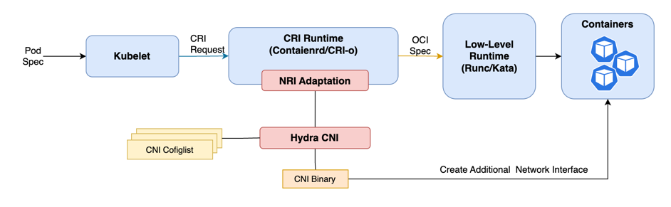

# Hydra-CNI

Hydra enables attaching multiple network interfaces to pods in Kubernetes leverage NRI.

## The differences between Hydra CNI and Multus

- Multus needs to be set as the default CNI for Kubernetes. If an existing cluster already has a CNI, the configuration needs to be modified to make Multus the default CNI. When using Multus, Kubernetes is aware of its presence.
- Hydra CNI is not set as the default CNI for Kubernetes. It needs to be deployed in a Kubernetes cluster that is already functioning properly. Hydra CNI is agnostic to Kubernetes. Its responsibility is solely to add additional network interfaces to Pods.

## How It works

Hydra is not a real CNI, but rather an NRI (Node Runtime Interface) plugin. It merely provides an interface to invoke CNI components in the container runtime during the RunPodSandbox process through NRI. In theory, Hydra can be combined and deployed with any CNI to provide additional network interfaces for Pods.


There is an Nginx pod with two network interfaces. The `eth0` interface is the default NIC, while the `hydra` interface is an additional NIC added by Hydra CNI.

```yaml
nuc-ubuntu22:~$ k exec -it nginx-app-f5b55f8cf-9jnjx -c busybox -- ip a
1: lo: <LOOPBACK,UP,LOWER_UP> mtu 65536 qdisc noqueue qlen 1000
    link/loopback 00:00:00:00:00:00 brd 00:00:00:00:00:00
    inet 127.0.0.1/8 scope host lo
       valid_lft forever preferred_lft forever
    inet6 ::1/128 scope host
       valid_lft forever preferred_lft forever
2: eth0@if254: <BROADCAST,MULTICAST,UP,LOWER_UP,M-DOWN> mtu 1450 qdisc noqueue
    link/ether d6:86:ce:6b:d0:d7 brd ff:ff:ff:ff:ff:ff
    inet 10.244.0.189/24 brd 10.244.0.255 scope global eth0
       valid_lft forever preferred_lft forever
    inet6 fe80::d486:ceff:fe6b:d0d7/64 scope link
       valid_lft forever preferred_lft forever
3: hydra@if257: <BROADCAST,MULTICAST,UP,LOWER_UP,M-DOWN> mtu 1450 qdisc noqueue
    link/ether fa:37:6f:11:cc:96 brd ff:ff:ff:ff:ff:ff
    inet 10.244.0.192/24 brd 10.120.0.2 scope global hydra
       valid_lft forever preferred_lft forever
    inet6 fe80::f837:6fff:fe11:cc96/64 scope link
       valid_lft forever preferred_lft forever
```

The IP, MAC, and other information associated with the additional NIC added by Hydra CNI will be updated in the annotations of the Pod.

```yaml
apiVersion: v1
kind: Pod
metadata:
  annotations:
    hydra.clusternet.io.cbr0: '{"cniVersion":"0.3.1","interfaces":[{"name":"cni0","mac":"be:71:6d:03:84:b9"},{"name":"vethc73add1c","mac":"06:83:65:    66:ba:6a"},{"name":"hydra","mac":"fa:37:6f:11:cc:96","sandbox":"/var/run/netns/cni-a4e0de73-4808-3160-47a7-f322a5202504"}],"ips":[{"version":"4","interface"    :2,"address":"10.244.0.192/24","gateway":"10.244.0.1"}],"routes":[{"dst":"10.244.0.0/16"},{"dst":"0.0.0.0/0","gw":"10.244.0.1"}],"dns":{}}'``
```
## **Quickstart Installation Guide**

Deploy Hydra CNI in an Existing Kubernetes Cluster.

Make sure that the Containerd version is ≥ v1.7.0 and  NRI is enabled.

update containerd to v1.7.0 and enable NRI.

```
CONTAINERD_VERSION=1.7.0
wget -c https://github.com/containerd/containerd/releases/download/v$CONTAINERD_VERSION/containerd-$CONTAINERD_VERSION-linux-amd64.tar.gz
sudo tar Czxvf /usr/local containerd-$CONTAINERD_VERSION-linux-amd64.tar.gz
sudo mkdir -p /etc/containerd/
containerd config default | sudo tee /etc/containerd/config.toml > /dev/null 2>&1
sudo sed -i 's/SystemdCgroup \= false/SystemdCgroup \= true/g' /etc/containerd/config.toml
sudo sed -i 's/disable \= true/disable \= false/g' /etc/containerd/config.toml
```

Deploy with another flannel CNI.

```yaml
git clone https://github.com/HydraCNI/Hydra.git
```

Prepare etcd for flannel subnetManger on master node

```
cd Hydra/hack/deployment/flannel
./update_etcd_cert.sh
kubectl apply -f hydra-cni-flannel-etcd-cert.yaml
kubectl apply -f etcd-service.yaml
```

check etcd service status

```
 kubectl describe svc -n kube-system kube-etcd
```

Deploy hydra-flannel(This is a Flannel instance with modified default parameters.)

```
kubectl apply -f hydra-cni-kube-flannel.yml
```

Deploy hydra-cni

```yaml
cd Hydra/hack/deployment/ 
kubectl apply -f clusternet-hydra-cni-daemonset.yaml
```